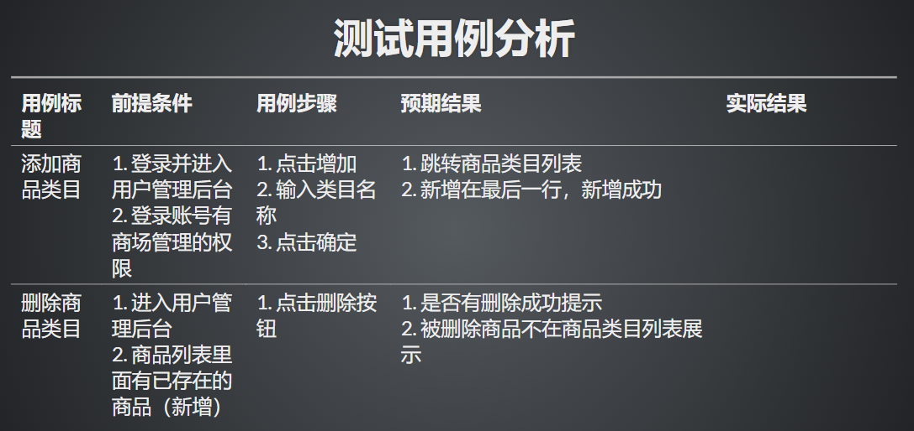

# master

 # 测试用例分析
    # 添加商品类型:

        """登录页面：用户登录"""
        # 访问登录页
        # 输入“用户名”
        # 输入“密码”
        # 点击“登录”按钮
        # ==》首页

        """系统首页：进入商品类目"""
        # 点击菜单“商场管理”
        # 点击菜单“商品类目”
        # ==》类目列表页面

        """类目列表页面：点击添加"""
        # 点击“添加”按钮
        # ==》创建类目页面

        """创建类目页面：创建类目"""
        # 输入“类目名称”
        # 点击“确定”按钮
        # ==》类目列表页面

        """类目列表页面：获取操作结果"""
        # 获取冒泡消息文本
        # ==》返回消息文本

